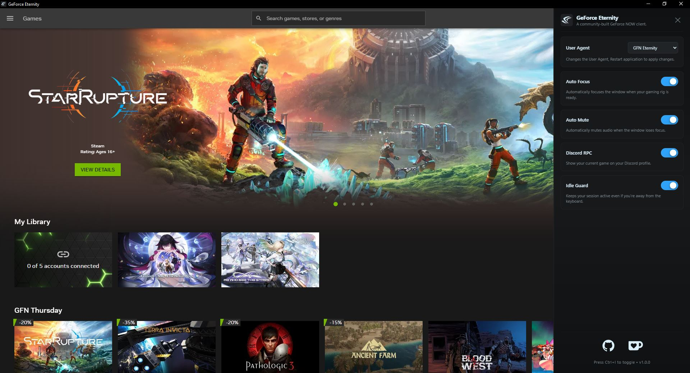
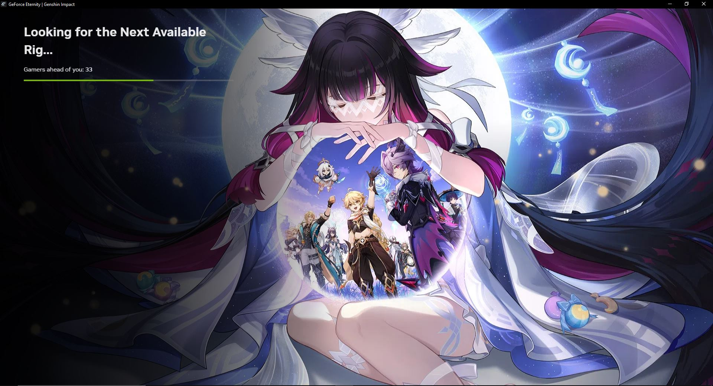
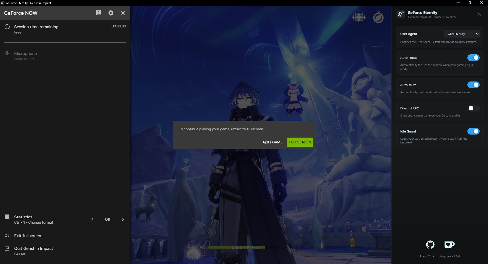

# GeForce Eternity

**GeForce Eternity** is an unofficial, community-driven desktop client for NVIDIA GeForce NOW. Built with Electron, it brings a native desktop experience to Windows, macOS, and Linux, along with extras like Discord Rich Presence and other quality-of-life improvements.

## **Screenshots**


<p align="center">
  
  
</p>

## 🎮 Features

- 🧩 **Custom User Agent**: Switch between GFN Eternity, Chrome, and Firefox user agents to optimize compatibility
- 🎯 **Auto Focus**: Automatically focuses the window when your gaming rig is ready
- 🔇 **Auto Mute**: Automatically mutes audio when the window loses focus
- 🖥️ **Multi-Platform**: Available for Windows, macOS, and Linux
- 💬 **Discord Rich Presence**: Display your gaming status on Discord
- 🛡️ **Idle Guard**: Prevents your gaming rig from going idle during streaming sessions  

*And more features coming over time!*

## 📥 Installation

Visit our [Release](https://github.com/SecureVoid/GeForce-Eternity/releases) page to access the latest **GeForce Eternity** builds, available as **ZIP** (binary), **DEB**, **AppImage**, **RPM**, and **EXE** packages.

## ⌨️ **Usage**

Press `Ctrl+I` to open sidebar to access GeForce Eternity features.

## 🧰 Build

### Prerequisites
You will need to install [npm](https://www.npmjs.com/), the Node.js package manager. On most distributions, the package is simply called `npm`.

1. Clone the repository:
    ```bash
    git clone https://github.com/securevoid/GeForce-Eternity.git
    cd GeForce-Eternity
    ```
2. Install dependencies:
    ```bash
    npm install
    ```
3. Start the app:
    ```bash
    npm start
    ```

## 👥 Credits

Inspired by the work of **[AstralVixen](https://github.com/AstralVixen)** and **[T0msk](https://github.com/t0msk)** from the GeForce Infinity project.

## 🤝 Contributing

Contributions are welcome! Whether it's bug fixes, feature requests, or UI improvements, feel free to open an issue or submit a pull request.

## 📜 License

MIT License. See [LICENSE](LICENSE) file for details.

## 📫 Support

- 🐞 **Report Bugs**: [GitHub Issues](https://github.com/securevoid/BetterGN/issues)
- ☕ **Support Development**: [Ko-fi](https://ko-fi.com/securevoid)
- 💭 **Discussions**: Use GitHub Discussions for questions and ideas